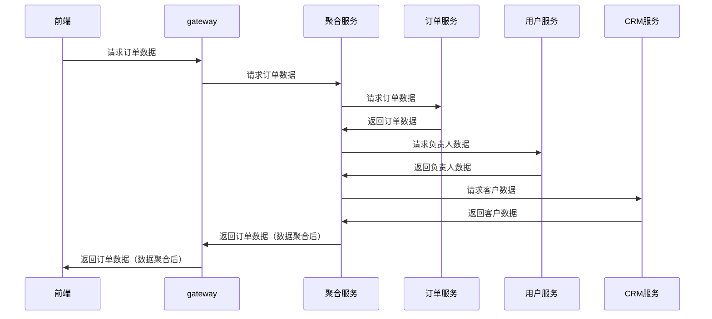

# 数据聚合

### 1.问题

微服务的难点：

> 微服务将单体服务中功能模块按功能拆分成多个微服务项目，已达到功能解耦的目的。但，由于拆分功能同时会将数据存储也进行拆分（甚至有的时候不同的微服务底层使用的数据持久化方案不同，比如：Mysql，MongoDB等），前端请求数据时可能存证跨服务数据返回。

例：

> 微服务：订单服务，用户服务，CRM服务
>
> 前端请求订单数据需要包含订单数据（订单服务），订单负责人信息（用户服务），客户信息（CRM服务）。

### 2.解决方案：

##### 前端处理

前端请求数据后，根据数据再分别请求其他服务。

例如：

1. 请求订单数据
2. 根据订单数据中的负责人id，请求用户服务数据
3. 根据订单数据中的客户数据，请求CRM服务数据

缺点：

+ 增加前端工作量
+ 增加响应时间。

##### 后端处理

在服务中调用其他服务将数据补全，然后返回到前端

例如：

1. 订单服务查询数据库得到订单数据
2. 根据订单数据中的负责人id，请求用户服务数据
3. 根据订单数据中的客户数据，请求CRM服务数据
4. 返回数据

缺点：

+ 增加后端工作量

##### BFF数据聚合(本项目采用的解决方案)

在前后端中间增加BFF数据聚合服务。

### 3.数据聚合

#### 3.1数据聚合过程



#### 3.2注解：

##### Aggregation

+ 使用在方法上，只能使用在Web响应方法上，表示该方法供数据聚合调用返回聚合数据
+ 使用在集合属性上，配合AggregationParam使用
+ 使用在类上，表示类需要在聚合服务中聚合数据

```java
@Target({ ElementType.TYPE, ElementType.FIELD, ElementType.METHOD })
@Retention(RetentionPolicy.RUNTIME)
@Documented
public @interface Aggregation {
    /**
     * 参数
     * @return
     */
    AggregationParam[] params() default {};
}
```


**AggregationParam** 

配合Aggregation的属性上使用

```java
public @interface AggregationParam {
    /**
     * 查询参数名
     * @return
     */
    String name();

    /**
     * 查询参数引用或者常量值
     * @return
     */
    String value();

    /**
     * 是否是常量
     * @return
     */
    boolean constant() default false;
}
```

+ name 参数名，与聚合服务提供接口的参数一致
+ value 取值
  + 如果constant为true，则为字面值
  + 如果constant为false，则使用当前对象的名字为value属性值


例如：

需求侧：

```java
public class DepartmentDetail{
    private String id; // 假设id值为D0001
    private String name;
    /** departmentId为服务提供接口的参数
     *  因为constant为false
     *  value为id，则调用服务提供接口时，参数为departmentId=D0001
     */
    @Aggregation(params={@AggregationParam(name="departmentId",value="id")})
    private List<UserAggregation> members;
}

```

提供侧：

```java
@Aggregation
public class UserAggregation {
    private String id; // id需要和UserAggregationController的PathVariable对应
    private String name;
    // 省略getter setter
}

@RestController
@RequestMapping("aggregation/users")
public class UserAggregationController {
    @Aggregation
    @GetMapping()
    public List<UserAggregation> getAggregation(
        @RequestParam("departmentId")String departmentId){
        // 返回UserAggregation数组
    }
}
```

> **注意**
>
> 如果是非空集合则不需要使用@Aggregation
>
> 例如：
>
> ```java
> @Aggregation
> public class UserAggregation {
>     private String id; // id需要和UserAggregationController的PathVariable对应
>     private String name;
>     // 省略getter setter constructure
> }
> 
> @RestController
> @RequestMapping("aggregation/users")
> public class UserAggregationController {
>     @Aggregation
>     @GetMapping("{id}")
>     public UserAggregation getAggregation(@PathVariable("id")String id){
>         // 省略返回UserAggregation
>     }
> }
> 
> public class DepartmentDetail{
>     private String id; // 假设id值为D0001
>     private String name;
>     // members在逻辑中会被添加元素，不需要使用@Aggregation
>     // 会调用GET /aggregation/users/{id}
>     private List<UserAggregation> members;
> }
> 
> 
> 
> @RestController
> @RequestMapping("departments")
> public class DepartmentController{
>     @GetMapping("{id}")
>     public DepartmentDetail getDepartment(@PathVariable("id")String id){
>         DepartmentDetail detail = new DepartmentDetail();
>         List<UserAggregation> list = new ArrayList<>();
>         list.add(new UserAggregation('U01'));
>         list.add(new UserAggregation('U02'));
>         list.add(new UserAggregation('U03'));
>         detail.setMemebers(list);
>         return detail;
>     }
> }
> ```


#### 3.3实现

wy-aggregation-service

实现使用的是Egg框架（node.js)。node 对于IO有好性能。同时，由于js是弱类型语言，更容易对json数据处理。


#### 3.4示例

**用户服务**

```java
@Aggregation
public class UserAggregation {
    private String id; // id需要和UserAggregationController的PathVariable对应
    private String name;
    // 省略getter setter
}

@RestController
@RequestMapping("aggregation/users")
public class UserAggregationController {
    @Aggregation
    @GetMapping("{id}")
    public UserAggregation getAggregation(@PathVariable("id")String id){
        // 省略返回UserAggregation
    }

    @Aggregation
    @GetMapping()
    public List<UserAggregation> getAggregation(
        @RequestParam("departmentId")String departmentId){
        // 返回UserAggregation数组
    }
}
```

**CRM服务**

```java
@Aggregation
public class ClientAggregation {
    private String id;
    private String name;
    // 省略getter setter
}

@RestController
@RequestMapping("aggregation/cleints")
public class CleintAggregationController {
    @Aggregation
    @GetMapping("{id}")
    public ClientAggregation getAggregation(@PathVariable("id")String id){
        // 省略返回ClientAggregation
    }
}
```

**订单服务**

```java
public class Order{
    private String id;
    private String code;
    private UserAggregation admin; // 负责人
    private CleintAggregation client; // 客户
    // 省略getter setter
}
@RestController
@RequestMapping("orders")
public class OrderController {
    @GetMapping("{id}")
    public Order getOne(@PathVariable("id")String id){
        Order order = new Order();
        order.setAdmin(new UserAggregation('adminId'));// 需要设置adminId
        order.setClient(new ClientAggregation('clientId'));//需要设置clientId
        return order;
    }
}
```


